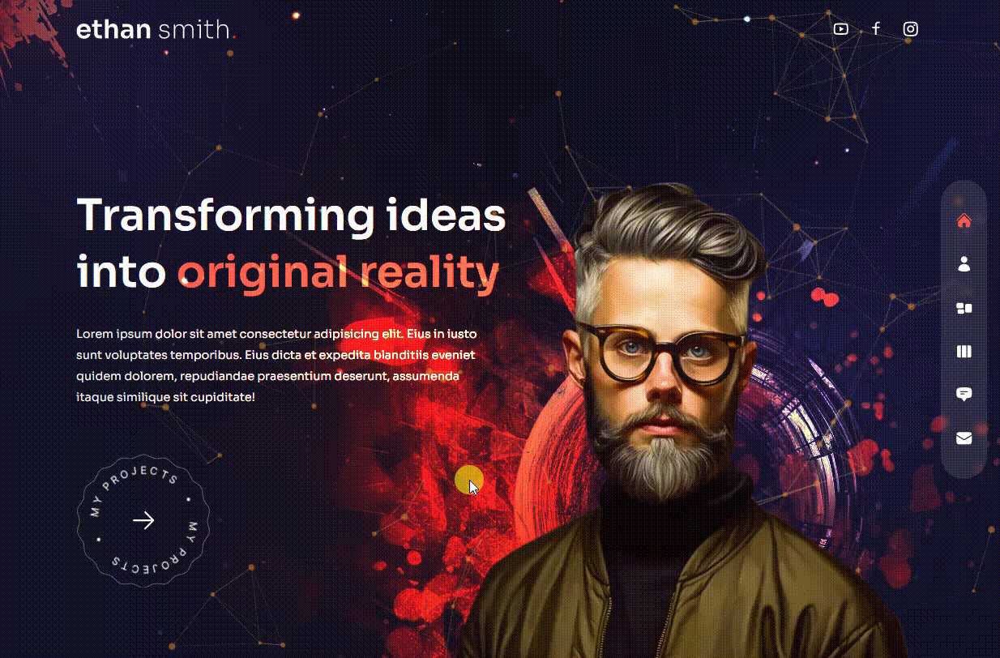

# NextJS & Tailwind - portfolio example 

# 🔗 [Live Preview](https://main--eclectic-biscotti-7a14e6.netlify.app/)

## About this project: 

This is a complex Portfolio website with advanced transitions,  animations and routing. Made with NextJS, Tailwind and Framer Motion. In this practice project, I learned about some new interesting packages that were also used.

Fully responsive, this learning project is directly inspired by (https://youtu.be/qp0-L_M3Ad4?si=PVinJqjDvjIWVB-S). I am aware that the project is not 100% perfect and that the code is using 999 divs instead of sections, articles, h123 and p tags but this was a learning project therefore I am not committed to getting it to perfection.

Project for some reason takes a long time to switch between pages despite the main transition animation being only 0.2 seconds. I don't know the reason for this.

---

## Pages 📙

* Home Page which features a really interesting interactive particle effect which is made using "tsparticles" package.

* About Page uses "react-countup" package which makes it easy to make the effect on numbers counting themselves. 

* Services Page is left to be customized because I did not agree with the design solutions in the original project.

* Work Page features an interesting carousel slider that displays 4 items on every slide. This effect is made possible by a very handy npm package called "swiper".

* Testimonials Page is a swipeable carousel also made with "swiper".

* Contact Page is just a simple form that is not functional.

 For all the packages used in the project, look inside "package.json"

---

## Languages and features 👨‍💻 

- NextJS: routing, components, maps, functions..
- Tailwind: for stylisation
- Framer Motion: for animations

Thanks for checking out my projects.

